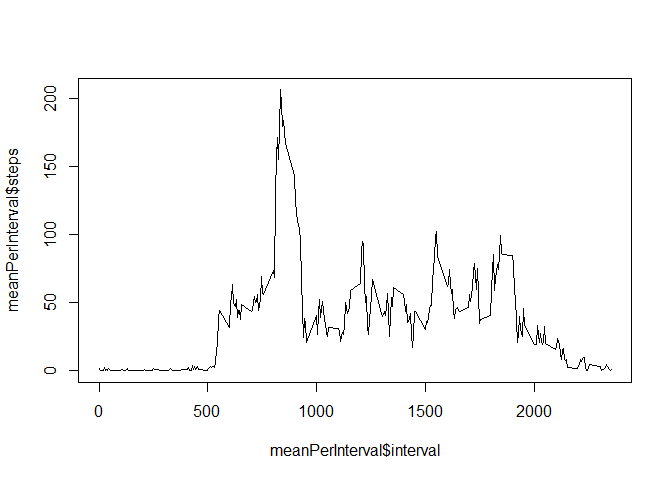

```r
library(dplyr)
```

```
## Warning: package 'dplyr' was built under R version 3.4.2
```

```
## 
## Attaching package: 'dplyr'
```

```
## The following objects are masked from 'package:stats':
## 
##     filter, lag
```

```
## The following objects are masked from 'package:base':
## 
##     intersect, setdiff, setequal, union
```

```r
library(lubridate)
```

```
## Warning: package 'lubridate' was built under R version 3.4.2
```

```
## 
## Attaching package: 'lubridate'
```

```
## The following object is masked from 'package:base':
## 
##     date
```

```r
library(lattice)
```

```
## Warning: package 'lattice' was built under R version 3.4.2
```

## Loading and preprocessing the data

```r
setwd("C:/Users/Jimmy/Documents/GitHub/RepData_PeerAssessment1")
unzip("./activity.zip", exdir = "../DataSets")

df <- read.csv("./DataSets/activity.csv")

df$date <- as.Date(df$date, format = "%Y-%m-%d")
df$DayPart <- day(df$date)
df$DayText <- weekdays(df$date)

df <- mutate(df, weekpart = ifelse(df$DayText %in% c("Saturday", "Sunday") , "Weekend", "Weekday"))

meanPerDay <-
df %>%
  select(date, steps) %>%
  group_by(date) %>%
  summarise_all(funs(mean(., na.rm=TRUE)))

medianPerDay <-
  df %>%
  select(date, steps) %>%
  group_by(date) %>%
  summarise_all(funs(median(., na.rm=TRUE)))

sumPerDay <-
  df %>%
  select(date, steps) %>%
  group_by(date) %>%
  summarise_all(funs(sum(., na.rm=TRUE)))
```

## What is mean total number of steps taken per day?


```r
histogram(~steps|DayText, data=na.omit(df), main="Distribution of steps by day of week")
```

<!-- -->

```r
mean(na.omit(sumPerDay$steps))
```

```
## [1] 9354.23
```

```r
median(na.omit(sumPerDay$steps))
```

```
## [1] 10395
```

## What is the average daily activity pattern?

```r
meanPerInterval <-
  df %>%
  select(interval, steps) %>%
  group_by(interval) %>%
  summarise_all(funs(mean(., na.rm=TRUE)))

plot(x=meanPerInterval$interval, y=meanPerInterval$steps, type = "l")
```

<!-- -->

```r
#Interval with maximum average steps
subset(meanPerInterval, meanPerInterval$steps==max(meanPerInterval$steps))
```

```
## # A tibble: 1 x 2
##   interval    steps
##      <int>    <dbl>
## 1      835 206.1698
```

## Imputing missing values

```r
#Number of missing valuese
sum(is.na(df$steps))
```

```
## [1] 2304
```

```r
#Use the mean for the interval to fill in missing values

dfMissing <- subset(df, is.na(steps))
dfMissing$steps <- round(meanPerInterval[match(dfMissing$interval, meanPerInterval$interval),2])$steps

df2 <- rbind(dfMissing, subset(df, !is.na(steps)))

meanPerDay2 <-
  df2 %>%
  select(date, steps) %>%
  group_by(date) %>%
  summarise_all(funs(mean(., na.rm=TRUE)))

medianPerDay2 <-
  df2 %>%
  select(date, steps) %>%
  group_by(date) %>%
  summarise_all(funs(median(., na.rm=TRUE)))

sumPerDay2 <-
  df2 %>%
  select(date, steps) %>%
  group_by(date) %>%
  summarise_all(funs(sum(., na.rm=TRUE)))
  
histogram(~steps|DayText, data=na.omit(df2), main="Distribution of steps by day of week")
```

<!-- -->

```r
#Difference in mean and median for set without missing values set with imputed missing values
mean(na.omit(sumPerDay$steps)) - mean(na.omit(sumPerDay2$steps))
```

```
## [1] -1411.41
```

```r
median(na.omit(sumPerDay$steps)) - median(na.omit(sumPerDay2$steps))
```

```
## [1] -367
```


## Are there differences in activity patterns between weekdays and weekends?

```r
meanPerIntervalWeekPart <-
  df2 %>%
  select(interval, weekpart, steps) %>%
  group_by(interval, weekpart) %>%
  summarise_all(funs(mean(., na.rm=TRUE)))

xyplot(steps ~ interval|factor(weekpart), data=meanPerIntervalWeekPart, type="l")
```

<!-- -->

